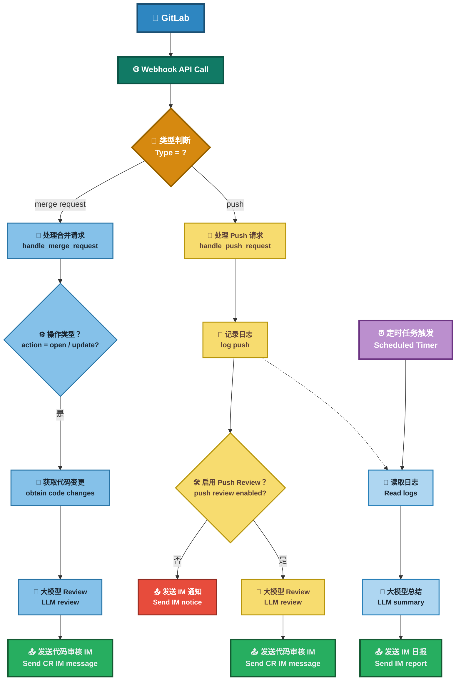

```mermaid
flowchart TD
    A["🎯 GitLab"] --> B["🌐 Webhook API Call"]
    B --> C{"📂 类型判断<br/>Type = ?"}
    
    %% Merge Request 流程
    C -- "merge request" --> D["📌 处理合并请求<br/>handle_merge_request"]
    D --> E{"⚙️ 操作类型？<br/>action = open / update?"}
    E -- "是" --> F["🧾 获取代码变更<br/>obtain code changes"]
    F --> G["🤖 大模型 Review<br/>LLM review"]
    G --> H1["📤 发送代码审核 IM<br/>Send CR IM message"]
    
    %% Push 流程
    C -- "push" --> I["📌 处理 Push 请求<br/>handle_push_request"]
    I --> J["📝 记录日志<br/>log push"]
    J --> K{"🛠️ 启用 Push Review？<br/>push review enabled?"}
    K -- "否" --> L["📤 发送 IM 通知<br/>Send IM notice"]
    K -- "是" --> M["🤖 大模型 Review<br/>LLM review"]
    M --> H2["📤 发送代码审核 IM<br/>Send CR IM message"]

    %% 定时任务流程
    Z["⏰ 定时任务触发<br/>Scheduled Timer"] --> P["📂 读取日志<br/>Read logs"]
    P --> Q["🧠 大模型总结<br/>LLM summary"]
    Q --> H3["📤 发送 IM 日报<br/>Send IM report"]

    %% 虚线提示：日志来源
    J -.-> P

    %% 样式统一应用，避免遗漏
    style A fill:#2E86C1,stroke:#1B4F72,stroke-width:3px,color:#FFFFFF,font-weight:bold,font-size:18px
    style B fill:#117A65,stroke:#0B5345,stroke-width:3px,color:#FFFFFF,font-weight:bold,font-size:16px
    style C fill:#D68910,stroke:#9A6400,stroke-width:3px,color:#FFFFFF,font-weight:bold,font-size:16px

    style D fill:#85C1E9,stroke:#2874A6,stroke-width:2px,color:#1B2631,font-weight:bold,font-size:14px
    style E fill:#85C1E9,stroke:#2874A6,stroke-width:2px,color:#1B2631,font-weight:bold,font-size:14px
    style F fill:#85C1E9,stroke:#2874A6,stroke-width:2px,color:#1B2631,font-weight:bold,font-size:14px
    style G fill:#85C1E9,stroke:#2874A6,stroke-width:2px,color:#1B2631,font-weight:bold,font-size:14px

    style I fill:#F7DC6F,stroke:#B7950B,stroke-width:2px,color:#5D4037,font-weight:bold,font-size:14px
    style J fill:#F7DC6F,stroke:#B7950B,stroke-width:2px,color:#5D4037,font-weight:bold,font-size:14px
    style K fill:#F7DC6F,stroke:#B7950B,stroke-width:2px,color:#5D4037,font-weight:bold,font-size:14px
    style M fill:#F7DC6F,stroke:#B7950B,stroke-width:2px,color:#5D4037,font-weight:bold,font-size:14px

    style P fill:#AED6F1,stroke:#2980B9,stroke-width:2px,color:#1B2631,font-weight:bold,font-size:14px
    style Q fill:#AED6F1,stroke:#2980B9,stroke-width:2px,color:#1B2631,font-weight:bold,font-size:14px

    style H1 fill:#27AE60,stroke:#145A32,stroke-width:3px,color:#ECF0F1,font-weight:bold,font-size:15px
    style H2 fill:#27AE60,stroke:#145A32,stroke-width:3px,color:#ECF0F1,font-weight:bold,font-size:15px
    style H3 fill:#27AE60,stroke:#145A32,stroke-width:3px,color:#ECF0F1,font-weight:bold,font-size:15px

    style L fill:#E74C3C,stroke:#922B21,stroke-width:2px,color:#FFFFFF,font-weight:bold,font-size:14px

    style Z fill:#BB8FCE,stroke:#6C3483,stroke-width:3px,color:#FFFFFF,font-weight:bold,font-size:16px

```