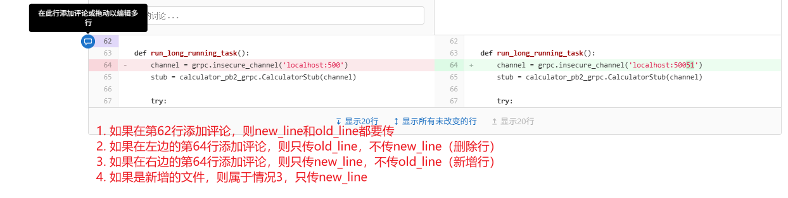
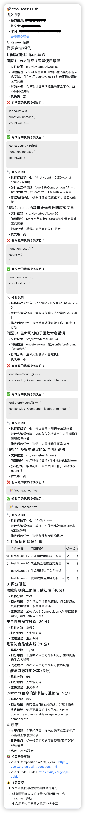
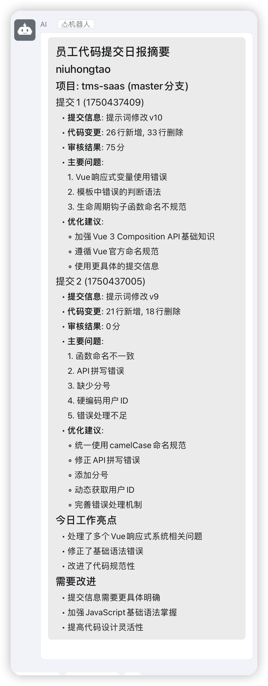
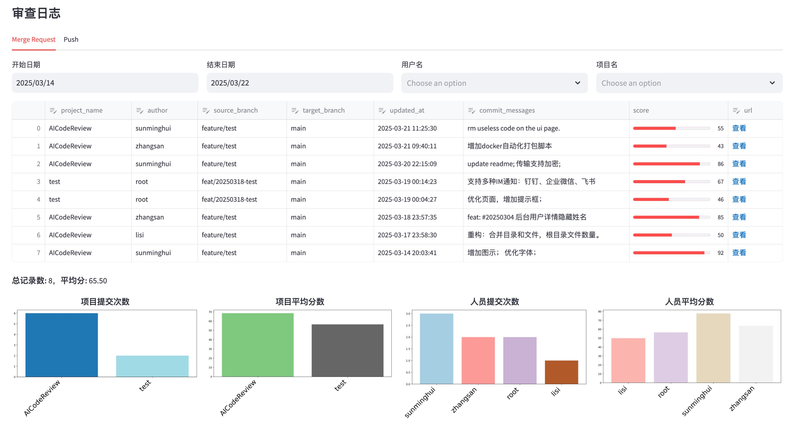
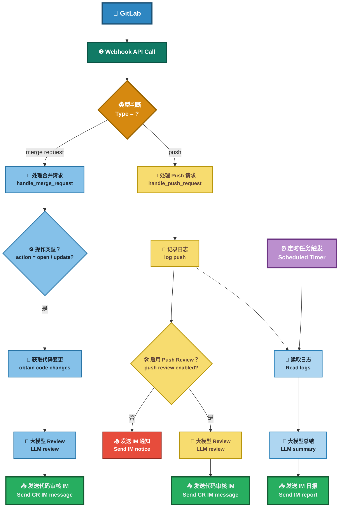

## Modify content
为了适配工作环境差异的需要，从
- [Easy-AI-CodeReview](https://github.com/spherical-up/Easy-AI-CodeReview) fork了一份用于修改
感谢原作者[sunmh207](https://github.com/sunmh207)开源[AI-Codereview-Gitlab](https://github.com/sunmh207/AI-Codereview-Gitlab)，请支持原作者。
感谢原作者[spherical-up](https://github.com/spherical-up)开源，请支持原作者。

### 改动点
1. gitlab v4 api中，较新版本的gitlab的MR的状态使用 `state: "opened", "reopened", "updated"`，项目中的判断条件进行同步修改

2. 增加`.proto`、`.yml`文件的review提示词

3. 使用`changes`、`diffs`、`compare`三种方式获取变更内容的坑
`/projects/:id/merge_requests/:merge_request_iid/changes` 接口`gitlab`后续会弃用，切换到`diffs`接口，但是当前项目`gitlab`版本不支持`diffs`接口（已检查对应版本的api文档），使用`sha+compare`接口替代`diffs`接口；不使用`changes`的原因是后续版本的`gitlab`会弃用`changes`接口，同时需要将`comment`添加到具体的`diff`行（这个改动目前只改了 MR，后续`Push`的也需要修改）
    - 这里有个坑，无论直接使用`/projects/:id/merge_requests/:merge_request_iid/changes`接口，还是使用替代方案的`/projects/:id/repository/compare?from={base_sha}&to={head_sha}`接口，都无法获取新增文件的`diff`（转了一圈回到原点了属于是），针对这个问题，查看了API文档，`changes`文档中说明使用`?access_raw_diffs=true`参数，可以禁用 `diff` 内容的截断机制（即使超过默认大小限制，也会返回完整内容）
    - 对于`changes`接口后续`gitlab`版本会弃用的问题，对当前项目环境无影响，因此暂不处理，新版本`gitlab`直接使用封装的`diffs`方法即可
    - 使用`changes`接口仍需注意变更特别多的场景（如3000+行变更，暂未测试），仍然可能由于分页导致`diff`被截断等场景，需要测试
    - 【方案备注】从网页访问`project/brunch/-/merge_requests/:merge_request_iid/diffs`是有数据的，但是使用api: `/projects/:id/merge_requests/:merge_request_iid/diffs`确获取不到数据，目前是看14.10版本的gitlab doc确实是没有相关接口的说明，很奇怪

4. review的语料（进行中）：
  当前：使用的是`diffs + 提交信息`，直接将diffs作为review的语料
  修改：
    - 方案一：使用单个`diff`（即单个文件的`diff`）`/diffs`（所有文件的`diff`，`diffs`接口返回的列表）作为`review`的语料（简单，但效果差，缺少上下文）
    - 方案二：单个文件的`diff` + 文件内容作为语料，效果稍好
    - √ 方案三：单个改动点的`diff`行 + 单个文件完整的`diff`内容 + 文件完整内容
    - 方案四：在方案三的基础上，引入完整仓库解析，缺点是算力要求过大，暂不进行，效果未验证

5. ~~增加一个 `GITLAB_USER_PRIVATE_TOKEN` 配置用于获取指定分支的文件~~，理解错误，应该复用`GITLAB_ACCESS_TOKEN`
  - 修改为优先从请求头获取，这样配合`gitlab webhook`设置`secret token`就能够实现通用所有仓库

6. 修改了添加评论的方式
  - 当前直接将AICR的结果评论到指定行，还有缺陷，需要完整查看api使用规范
    - 已知缺陷：
            如果文件为新增文件，添加行内评论的锚点是原分支的行号，由于原分支并没有对应的文件，所以gitlab自动计算出来的line_code为空
            看是否可以直接添加到目标分支上
    - 问题修复：
            对于新增文件，`POST /projects/:id/merge_requests/:merge_request_iid/discussions`接口不要上传`old_line`，否则会报错`{"message":"400 Bad request - Note {:line_code=>[\"不能为空字符\", \"must be a valid line code\"]}"}`
            修复了`extract_line_numbers()`方法的缺陷
    - 根本原因：
            根本原因是行号的传递没搞清楚，查看接口文档对应接口的`Create a new thread in the merge request diff`，简单的来说，增加评论的行如果是：新增行使用 new_line、删除行使用 old_line，未变更行需同时包含两者，如：
  - 为了避免使用出错或者异常，增加了一个兜底，如果添加行内评论失败，则使用旧的方法直接添加到MR中，并给出提示

7. 新增集成类`EnhancedOpenAIClient(OpenAIClient)`，支持模型参数设置

8. 新增`tokens`限制相关的方法
  - 当前模型总上下文长度为 16k（`'object': 'error', 'message': "This model's maximum context length is 16000 tokens.`）
  - 配置 15k 限制，限制`Input Tokens`为：10-12k；`Output Tokens`为：15k-10k，最长5k（纯汉字约5k，代码约几百行）
    - 限制传入ai的文件内容，如果超过10k token，就截取文件改动点的上下500行作为语料
    - `completions`方法内动态计算`max_tokens`，尽可能利用llm最大性能

9. 修改代理源，减少打包时间

10. 适配k8s健康检查的`livenessProbe`和`readinessProbe`接口

### 待办
1. Gitlab Push事件使用的changes接口需要修改
2. changes接口是否有性能问题，还需要测试，目前使用测试了3000行代码提交是正常的
3. Gitlab Push事件也需要需改为按照diff行进行评论
4. preprocessing_diffs中的正则需要详细测试不同情况会不会丢数据、正则是否正确等
5. 简化了提示词后，评分系统失效，暂不修改
6. 需要抓取Gitlab上对AICR的接口进行拒绝/通过的结果，以便统计效果等
7. 把当前的后端统计服务用起来（先修复评分系统）
8. √ `GITLAB_ACCESS_TOKEN` 和 `GITLAB_USER_PRIVATE_TOKEN`（新增的）是同一个东西，已删除后者， `GITLAB_ACCESS_TOKEN`可以通过`webhook`创建的时候通过请求头传递后端服务，即可通用所有仓库
9. 后端还需要过滤分支？但是这样不通用，不同仓库、甚至不同项目，分支可能都不一样，但是`webhook`配置的时候只有push可以配置分支，mr不能配置分支
10. 因为使用的是外网专线，需要监控/控制流量
11. 日志调整和优化、关debug日志
12. 考虑[把整个项目作为基础信息，再去ai审查代码](https://github.com/sunmh207/AI-Codereview-Gitlab/issues/10)

### 自测

#### 行内评论获取行号的自测场景
1. 在行号1处，增加3行 √
2. 在行号1处，删除3行 √
3. 在行号1处，修改1行 √
4. 在行号1处，修改3行 √
4. 新增文件 √
5. 删除文件 √
检查是否能够添加到对应的行号锚点

#### 新增函数说明（后面需要自测）
1. `handle_merge_request_event_v2`: 复写的`handle_merge_request_event`
2. `extract_line_numbers`: 根据diff获取行内评论的行号
3. `filter_diffs_by_file_types`: 复写的`filter_changes`，只过滤文件类型，不过滤字段
4. `preprocessing_diffs`: 预处理diffs
5. `get_merge_request_sha`
6. `get_merge_request_changes`: 修改
7. `get_merge_request_diffs`
8. `get_merge_request_diffs_from_base_sha_to_head_sha`
9. `add_merge_request_discussions_on_row`: 行内评论
10. `get_gitlab_file_content`
11. `review_code_simple`: AICR的核心，还需要完善可靠性等
12. `count_tokens`: AICR llm的基类增加了一个统计token的方法，当前只适配了OpenAI，其他大模型均未适配

## Easy-AI-CodeReview


## 项目简介

本项目是一个基于大模型的自动化代码审查工具，帮助开发团队在代码合并或提交时，快速进行智能化的审查(Code Review)，提升代码质量和开发效率。

## 功能

- 🚀 多模型灵活切换
  - 全面兼容 **DeepSeek、ZhipuAI、OpenAI、通义千问、Ollama** 想用哪个，用哪个！轻松上手，自由切换。
- 📢 消息实时送达
  - 审查结果 **一键推送** 到 **钉钉、企业微信、飞书**  及时响应，代码问题无所遁形！
- 📅 自动生成开发日报
  - 基于 **GitHub / GitLab Commit** 记录，自动梳理每日开发动态：  
谁在认真敲代码，谁在划水，一清二楚 😼。
- 📊 数据可视化 Dashboard
  - 集中展示所有 **Code Review 记录**，提供清晰的：
    - 项目整体统计  
    - 成员贡献分析  
  - 数据说话，甩锅无门！
- 🎭 多种审查风格，任你挑！
  | 风格 | 描述 | 示例 |
  |------|------|------|
  | 🤵 **专业型** | 严谨细致、正式专业 | *建议优化此函数的命名，以提升可读性。* |
  | 😈 **毒舌型** | 毒舌吐槽、直击要害 | *你确定这是人能读的代码？* |
  | 🌸 **绅士型** | 温柔委婉、如沐春风 | *或许这里可以再优化一下呢~* |
  | 🤪 **幽默型** | 搞笑风趣、快乐改码 | *这段 if-else 比我相亲经历还复杂！* |


**效果图:**






<!--  -->

## 原理

在开发者向 GitLab 提交代码（包括 Merge Request 创建或 Push 操作）时，GitLab 会根据预设的 Webhook 配置触发回调请求，调用本系统提供的接口。系统接收到事件后，将解析提交内容，并通过集成的第三方大语言模型对代码变更进行静态审查。

审查内容包括但不限于：代码规范检查、潜在错误识别、安全风险分析及可维护性建议。完成审查后，系统会将结果以评论的形式自动回写至对应的 Merge Request 或 Commit 页面，确保审查反馈能够实时集成至开发工作流中，从而提升代码质量与团队协作效率。

**流程图**


## 部署

### 方案一：Docker 部署

**1. 准备环境文件**

- 克隆项目仓库：
```aiignore
git clone https://github.com/spherical-up/Easy-AI-CodeReview
cd Easy-AI-CodeReview
```

- 创建配置文件：
```aiignore
cp conf/.env.dist conf/.env
```

- 编辑 conf/.env 文件，配置以下关键参数：

```bash
#大模型供应商配置,支持 zhipuai , openai , deepseek 和 ollama
LLM_PROVIDER=deepseek

#DeepSeek
DEEPSEEK_API_KEY={YOUR_DEEPSEEK_API_KEY}

#支持review的文件类型(未配置的文件类型不会被审查)
SUPPORTED_EXTENSIONS=.java,.py,.php,.yml,.vue,.go,.c,.cpp,.h,.js,.css,.md,.sql

#钉钉消息推送: 0不发送钉钉消息,1发送钉钉消息
DINGTALK_ENABLED=0
DINGTALK_WEBHOOK_URL={YOUR_WDINGTALK_WEBHOOK_URL}

#Gitlab配置
GITLAB_ACCESS_TOKEN={YOUR_GITLAB_ACCESS_TOKEN}
```

**2. 启动服务**

```bash
docker-compose up -d
```

**3. 验证部署**

- 主服务验证：
  - 访问 http://your-server-ip:5001
  - 显示 "The code review server is running." 说明服务启动成功。
- Dashboard 验证：
  - 访问 http://your-server-ip:5002
  - 看到一个审查日志页面，说明 Dashboard 启动成功。

### 方案二：本地Python环境部署

**1. 获取源码**

```bash
git clone https://github.com/spherical-up/Easy-AI-CodeReview
cd AI-Codereview-Gitlab
```

**2. 安装依赖**

使用 Python 环境（建议使用虚拟环境 venv）安装项目依赖(Python 版本：3.10+):

```bash
pip install -r requirements.txt
```

**3. 配置环境变量**

同 Docker 部署方案中的.env 文件配置。

**4. 启动服务**

- 启动API服务：

```bash
python api.py
```

- 启动Dashboard服务：

```bash
streamlit run ui.py --server.port=5002 --server.address=0.0.0.0
```


- 如果打开了防火墙，则先放通对应的端口：
```bash
firewall-cmd --zone=public --add-port=5002/tcp --permanent
firewall-cmd --reload
```

### 配置 GitLab Webhook

#### 1. 创建Access Token

方法一：在 GitLab 个人设置中，创建一个 Personal Access Token。

方法二：在 GitLab 项目设置中，创建Project Access Token

#### 2. 配置 Webhook

在 GitLab 项目设置中，配置 Webhook：

- URL：http://your-server-ip:5001/review/webhook
- Trigger Events：勾选 Push Events 和 Merge Request Events (不要勾选其它Event)
- Secret Token：上面配置的 Access Token(可选)

**备注**

1. Token使用优先级
  - 系统优先使用 .env 文件中的 GITLAB_ACCESS_TOKEN。
  - 如果 .env 文件中没有配置 GITLAB_ACCESS_TOKEN，则使用 Webhook 传递的Secret Token。
2. 网络访问要求
  - 请确保 GitLab 能够访问本系统。
  - 若当前项目环境受限，建议将系统部署在外网服务器上。

### 配置消息推送

#### 1.配置钉钉推送

- 在钉钉群中添加一个自定义机器人，获取 Webhook URL。
- 更新 .env 中的配置：
  ```
  #钉钉配置
  DINGTALK_ENABLED=1  #0不发送钉钉消息，1发送钉钉消息
  DINGTALK_WEBHOOK_URL=https://oapi.dingtalk.com/robot/send?access_token=xxx #替换为你的Webhook URL
  ```

企业微信和飞书推送配置类似，具体参见 [常见问题](doc/faq.md)

## 其它

**1.如何对整个代码库进行Review?**

可以通过命令行工具对整个代码库进行审查。当前功能仍在不断完善中，欢迎试用并反馈宝贵意见！具体操作如下：

```bash
python -m biz.cmd.review
```

运行后，请按照命令行中的提示进行操作即可。

**2.其它问题**

参见 [常见问题]记录(doc/faq.md)
