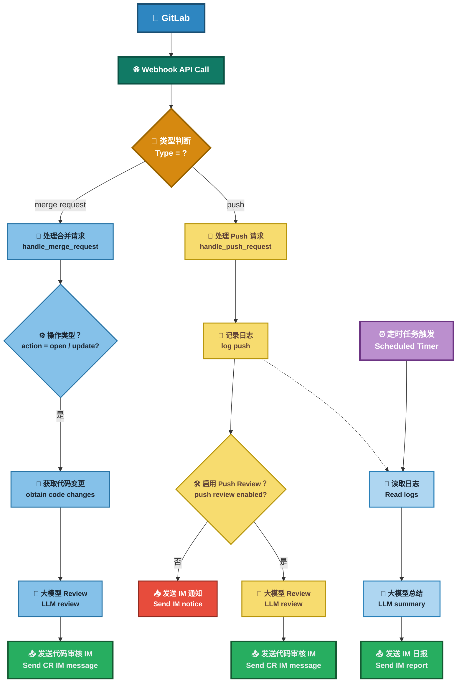

## Modify content
为了适配工作环境差异的需要，从
- [Easy-AI-CodeReview](https://github.com/spherical-up/Easy-AI-CodeReview) fork了一份用于修改

感谢原作者[spherical-up](https://github.com/spherical-up)开源，请支持原作者。

### Modify
1. gitlab v4 api中，较新版本的gitlab的MR的状态使用 `state: "opened", "reopened", "updated"`，项目中的判断条件进行同步修改

## Easy-AI-CodeReview


## 项目简介

本项目是一个基于大模型的自动化代码审查工具，帮助开发团队在代码合并或提交时，快速进行智能化的审查(Code Review)，提升代码质量和开发效率。

## 功能

- 🚀 多模型灵活切换
  - 全面兼容 **DeepSeek、ZhipuAI、OpenAI、通义千问、Ollama** 想用哪个，用哪个！轻松上手，自由切换。
- 📢 消息实时送达
  - 审查结果 **一键推送** 到 **钉钉、企业微信、飞书**  及时响应，代码问题无所遁形！
- 📅 自动生成开发日报
  - 基于 **GitHub / GitLab Commit** 记录，自动梳理每日开发动态：  
谁在认真敲代码，谁在划水，一清二楚 😼。
- 📊 数据可视化 Dashboard
  - 集中展示所有 **Code Review 记录**，提供清晰的：
    - 项目整体统计  
    - 成员贡献分析  
  - 数据说话，甩锅无门！
- 🎭 多种审查风格，任你挑！
  | 风格 | 描述 | 示例 |
  |------|------|------|
  | 🤵 **专业型** | 严谨细致、正式专业 | *建议优化此函数的命名，以提升可读性。* |
  | 😈 **毒舌型** | 毒舌吐槽、直击要害 | *你确定这是人能读的代码？* |
  | 🌸 **绅士型** | 温柔委婉、如沐春风 | *或许这里可以再优化一下呢~* |
  | 🤪 **幽默型** | 搞笑风趣、快乐改码 | *这段 if-else 比我相亲经历还复杂！* |


**效果图:**


<!--  -->

## 原理

在开发者向 GitLab 提交代码（包括 Merge Request 创建或 Push 操作）时，GitLab 会根据预设的 Webhook 配置触发回调请求，调用本系统提供的接口。系统接收到事件后，将解析提交内容，并通过集成的第三方大语言模型对代码变更进行静态审查。

审查内容包括但不限于：代码规范检查、潜在错误识别、安全风险分析及可维护性建议。完成审查后，系统会将结果以评论的形式自动回写至对应的 Merge Request 或 Commit 页面，确保审查反馈能够实时集成至开发工作流中，从而提升代码质量与团队协作效率。

**流程图**


## 部署

### 方案一：Docker 部署

**1. 准备环境文件**

- 克隆项目仓库：
```aiignore
git clone https://github.com/spherical-up/Easy-AI-CodeReview
cd Easy-AI-CodeReview
```

- 创建配置文件：
```aiignore
cp conf/.env.dist conf/.env
```

- 编辑 conf/.env 文件，配置以下关键参数：

```bash
#大模型供应商配置,支持 zhipuai , openai , deepseek 和 ollama
LLM_PROVIDER=deepseek

#DeepSeek
DEEPSEEK_API_KEY={YOUR_DEEPSEEK_API_KEY}

#支持review的文件类型(未配置的文件类型不会被审查)
SUPPORTED_EXTENSIONS=.java,.py,.php,.yml,.vue,.go,.c,.cpp,.h,.js,.css,.md,.sql

#钉钉消息推送: 0不发送钉钉消息,1发送钉钉消息
DINGTALK_ENABLED=0
DINGTALK_WEBHOOK_URL={YOUR_WDINGTALK_WEBHOOK_URL}

#Gitlab配置
GITLAB_ACCESS_TOKEN={YOUR_GITLAB_ACCESS_TOKEN}
```

**2. 启动服务**

```bash
docker-compose up -d
```

**3. 验证部署**

- 主服务验证：
  - 访问 http://your-server-ip:5001
  - 显示 "The code review server is running." 说明服务启动成功。
- Dashboard 验证：
  - 访问 http://your-server-ip:5002
  - 看到一个审查日志页面，说明 Dashboard 启动成功。

### 方案二：本地Python环境部署

**1. 获取源码**

```bash
git clone https://github.com/spherical-up/Easy-AI-CodeReview
cd AI-Codereview-Gitlab
```

**2. 安装依赖**

使用 Python 环境（建议使用虚拟环境 venv）安装项目依赖(Python 版本：3.10+):

```bash
pip install -r requirements.txt
```

**3. 配置环境变量**

同 Docker 部署方案中的.env 文件配置。

**4. 启动服务**

- 启动API服务：

```bash
python api.py
```

- 启动Dashboard服务：

```bash
streamlit run ui.py --server.port=5002 --server.address=0.0.0.0
```


- 如果打开了防火墙，则先放通对应的端口：
```bash
firewall-cmd --zone=public --add-port=5002/tcp --permanent
firewall-cmd --reload
```

### 配置 GitLab Webhook

#### 1. 创建Access Token

方法一：在 GitLab 个人设置中，创建一个 Personal Access Token。

方法二：在 GitLab 项目设置中，创建Project Access Token

#### 2. 配置 Webhook

在 GitLab 项目设置中，配置 Webhook：

- URL：http://your-server-ip:5001/review/webhook
- Trigger Events：勾选 Push Events 和 Merge Request Events (不要勾选其它Event)
- Secret Token：上面配置的 Access Token(可选)

**备注**

1. Token使用优先级
  - 系统优先使用 .env 文件中的 GITLAB_ACCESS_TOKEN。
  - 如果 .env 文件中没有配置 GITLAB_ACCESS_TOKEN，则使用 Webhook 传递的Secret Token。
2. 网络访问要求
  - 请确保 GitLab 能够访问本系统。
  - 若内网环境受限，建议将系统部署在外网服务器上。

### 配置消息推送

#### 1.配置钉钉推送

- 在钉钉群中添加一个自定义机器人，获取 Webhook URL。
- 更新 .env 中的配置：
  ```
  #钉钉配置
  DINGTALK_ENABLED=1  #0不发送钉钉消息，1发送钉钉消息
  DINGTALK_WEBHOOK_URL=https://oapi.dingtalk.com/robot/send?access_token=xxx #替换为你的Webhook URL
  ```

企业微信和飞书推送配置类似，具体参见 [常见问题](doc/faq.md)

## 其它

**1.如何对整个代码库进行Review?**

可以通过命令行工具对整个代码库进行审查。当前功能仍在不断完善中，欢迎试用并反馈宝贵意见！具体操作如下：

```bash
python -m biz.cmd.review
```

运行后，请按照命令行中的提示进行操作即可。

**2.其它问题**

参见 [常见问题]记录(doc/faq.md)
